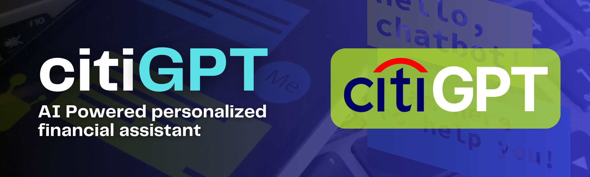
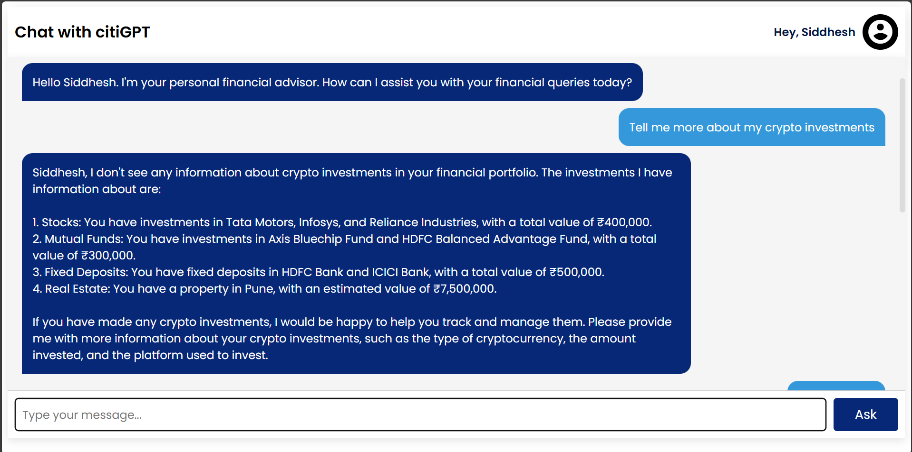
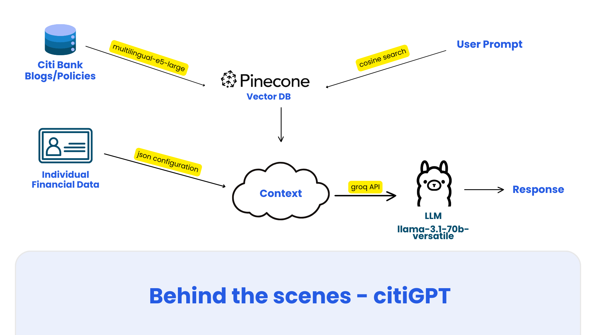

<a name="readme-top"></a>

[![Contributors][contributors-shield]][contributors-url]
[![Forks][forks-shield]][forks-url]
[![Stargazers][stars-shield]][stars-url]
[![Issues][issues-shield]][issues-url]
[![LinkedIn][linkedin-shield]][linkedin-url]

<!-- PROJECT LOGO -->
<br/>
<div align="center">
  <a href="https://github.com/siddhesh-desai/citiGPT">
    
  </a>
    <br>
    <br>

  <h3 align="center"><b>citiGPT - Personalized Finance Assistant</b></h3>
  <h4 align="center"><b>Feature from Winning Project at Ada Lovelace Hackathon 2023 organised by Citi Bank</b></h4>

  <p align="center">
    citiGPT is an intelligent personal assistant designed to improve customer experience for Citi Bank users. With access to your financial data and Citi Bank's services and schemes, citiGPT provides personalized responses to queries such as your current balance, recent transactions, and more. Powered by a combination of Pinecone, LLaMA models via Groq API, citiGPT enables a seamless, secure interaction with your finances. 
    <br />
    <br>
    <a href="https://github.com/siddhesh-desai/citiGPT"><strong>Explore the docs »</strong></a>
    <br />
    <a href="https://github.com/siddhesh-desai/citiGPT">View Demo</a>
    ·
    <a href="https://github.com/siddhesh-desai/citiGPT/issues">Report Bug</a>
    ·
    <a href="https://github.com/siddhesh-desai/citiGPT/issues">Request Feature</a>
  </p>
</div>

<!-- ABOUT THE PROJECT -->
<br>

## ♾️ About The Project

citiGPT was developed during the Ada Lovelace Hackathon organized by Citi Bank, focusing on improving customer experience. This AI-driven assistant allows customers to interact with their financial data seamlessly. By leveraging cutting-edge tools like Pinecone for vector search and LLaMA via Groq API, citiGPT delivers personalized responses to complex finance-related queries like:

- "What is my current balance?"
- "What is my family's spending this month?"
- "What are the latest Citibank schemes and offers?"

By integrating Citibank's real-time data on interest rates, schemes, and other financial products, citiGPT provides an all-in-one personal finance manager.

<b>Our team won the hackathon with this project, showcasing how AI can transform personal finance management.</b>

<p align="right">(<a href="#readme-top">back to top</a>)</p>

## ⚙️ Built With

The technologies and tools used are:

- [![JavaScript][javascript]][javascript-url]
- [![Langchain][langchain]][langchain-url]
- [![LLama][llama]][llama-url]
- [![Pinecone][pinecone]][pinecone-url]
- [![HTML][html]][html-url]
- [![CSS][css]][css-url]
- [![ExpressJS][express]][express-url]
- [![NodeJS][node]][node-url]

<p align="right">(<a href="#readme-top">back to top</a>)</p>

<!-- GETTING STARTED -->

## 🧑‍💻 Getting Started

Follow the below steps to set up the project:

### Prerequisites

API keys for Pinecone and Groq

### Installation

1. Clone the repository

   ```sh
   git clone https://github.com/siddhesh-desai/citiGPT.git
   ```

2. Install the dependencies:

   ```sh
   npm i
   ```

3. Replace the below API Keys with your ones in `.env` file:

   ```sh
   PINECONE_API_KEY='YOUR_PINECONE_API_KEY'
   GROQ_API_KEY='YOUR_GROQ_API_KEY'
   PINECONE_INDEX_NAME = 'citiwise-open'
   PINECONE_INDEX_NAMESPACE= 'main-citi-site'
   ```

4. Run the application

   ```sh
   node index.js
   ```

5. If you want to add more sites to Pinecone database, change the url inside `scripts/add_site_to_pinecone.js` and execute.

<p align="right">(<a href="#readme-top">back to top</a>)</p>

<!-- USAGE EXAMPLES -->

## 💡 Features

<br>

- Personalized finance queries: Get answers to personal and family finance data.
- Access Citibank's real-time data: Schemes, interest rates, and offers.
- Highly secure: Keeps your financial data safe using Pinecone's vector database.
- AI-powered responses: Powered by LLaMA for contextual and accurate responses.

<p align="right">(<a href="#readme-top">back to top</a>)</p>

<!-- ROADMAP -->

## 🛣️ Roadmap

- [x] Query personal finance data
- [x] Fetch Citibank’s latest schemes and offers
- [ ] Dark Mode
- [ ] Integration of Voice Assistant

See the [open issues](https://github.com/siddhesh-desai/SlideAI/issues) for a full list of proposed features (and known issues).

<p align="right">(<a href="#readme-top">back to top</a>)</p>

<!-- CONTRIBUTING -->

## 👣 Contributing

Any contributions you make are **greatly appreciated**.

If you have a suggestion that would make this better, please fork the repo and create a pull request. You can also simply open an issue with the tag "enhancement".
Don't forget to give the project a star! Thanks again!

1. Fork the Project
2. Create your Feature Branch (`git checkout -b feature/AmazingFeature`)
3. Commit your Changes (`git commit -m 'Add some AmazingFeature'`)
4. Push to the Branch (`git push origin feature/AmazingFeature`)
5. Open a Pull Request

<p align="right">(<a href="#readme-top">back to top</a>)</p>

<!-- CONTACT -->

## 📧 Contact

Siddhesh Desai - [@thesiddheshdesai](https://www.linkedin.com/in/thesiddheshdesai/) - siddheshdesai777@gmail.com

Project Link: [https://github.com/siddhesh-desai/citiGPT](https://github.com/siddhesh-desai/citiGPT)

<p align="right">(<a href="#readme-top">back to top</a>)</p>

## 📸 Screenshots

<br>

<br>


## ✨ Contributors

Thanks go to these wonderful people:

- [Siddhesh Desai](https://github.com/siddhesh-desai/)
- [Rajkumar Dongre](https://github.com/rajkumardongre/)
- [Sanket Disale](https://github.com/sanketdisale871/)
- [Sanskruti Khedkar](https://github.com/sanskrutikhedkar9/)
- [Samarth Bura](https://github.com/samarthNV/)
- [Tejaswini Wanare](https://github.com/Tejaswini-9703/)

[contributors-shield]: https://img.shields.io/github/contributors/siddhesh-desai/SlideAI.svg?style=for-the-badge
[contributors-url]: https://github.com/siddhesh-desai/SlideAI/graphs/contributors
[forks-shield]: https://img.shields.io/github/forks/siddhesh-desai/SlideAI.svg?style=for-the-badge
[forks-url]: https://github.com/siddhesh-desai/SlideAI/network/members
[stars-shield]: https://img.shields.io/github/stars/siddhesh-desai/SlideAI.svg?style=for-the-badge
[stars-url]: https://github.com/siddhesh-desai/SlideAI/stargazers
[issues-shield]: https://img.shields.io/github/issues/siddhesh-desai/SlideAI.svg?style=for-the-badge
[issues-url]: https://github.com/siddhesh-desai/SlideAI/issues
[license-shield]: https://img.shields.io/github/license/siddhesh-desai/SlideAI.svg?style=for-the-badge
[license-url]: https://github.com/siddhesh-desai/SlideAI/blob/master/LICENSE.txt
[linkedin-shield]: https://img.shields.io/badge/-LinkedIn-black.svg?style=for-the-badge&logo=linkedin&colorB=555
[linkedin-url]: https://linkedin.com/in/thesiddheshdesai
[javascript]: https://img.shields.io/badge/Javascript-000000?style=for-the-badge&logo=javascript&logoColor=white
[javascript-url]: https://developer.mozilla.org/en-US/docs/Web/JavaScript
[langchain]: https://img.shields.io/badge/Langchain-0769AD?style=for-the-badge&logo=langchain&logoColor=white
[langchain-url]: https://js.langchain.com/v0.2/docs/introduction/
[llama]: https://img.shields.io/badge/LLama-20232A?style=for-the-badge&logo=ollama&logoColor=61DAFB
[llama-url]: https://www.llama.com/
[pinecone]: https://img.shields.io/badge/Pinecone-000000?style=for-the-badge&logo=victoriametrics&logoColor=white
[pinecone-url]: https://docs.pinecone.io/home
[html]: https://img.shields.io/badge/HTML-20232A?style=for-the-badge&logo=html5&logoColor=61DAFB
[html-url]: https://developer.mozilla.org/en-US/docs/Web/HTML
[css]: https://img.shields.io/badge/Css-000000?style=for-the-badge&logo=css3&logoColor=white
[css-url]: https://developer.mozilla.org/en-US/docs/Web/CSS
[js]: https://img.shields.io/badge/Javscript-0769AD?style=for-the-badge&logo=javascript&logoColor=white
[js-url]: https://developer.mozilla.org/en-US/docs/Web/javascript
[mongodb]: https://img.shields.io/badge/mongodb-20232A?style=for-the-badge&logo=mongodb&logoColor=61DAFB
[mongodb-url]: https://www.mongodb.com/docs/
[express]: https://img.shields.io/badge/expressjs-000000?style=for-the-badge&logo=express&logoColor=white
[express-url]: https://expressjs.com/
[node]: https://img.shields.io/badge/NodeJS-0769AD?style=for-the-badge&logo=node.js&logoColor=white
[node-url]: https://nodejs.org/en/docs
